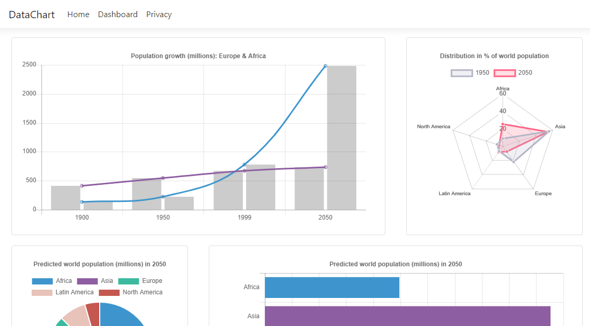

# ChartJS_MVC
Boilerplate for MVC app dashboard using [Chart.js](https://www.chartjs.org/).

<p align="center">
  
</p>

## Dependencies
* Chart.js
* bootstrap

## Styling 
1. Add in a chart into an MVC view's `<body>` tag with the canvas and script elements using [this method](https://www.chartjs.org/docs/latest/getting-started/usage.html).
2. Add the following script to the `<head>` tag:
`<script src="https://cdnjs.cloudflare.com/ajax/libs/Chart.js/2.6.0/Chart.min.js" type="text/javascript"></script>`
2. Bootstrap helps to display the components in rows. The following styling helps to space the charts from each other and stretch their height to each chart container: 
```
    <div class="row">
        <div class="col-xl-8 col-md-12"  style="padding: 0px 20px 20px 20px;">
            <div class="card card-default" style="height:100%;">
                <div class="card-body">
                    <div class="chart-container">
                        <canvas id="mixed-chart"></canvas>
                        <script>
                        ...

```

## Adding Charts 
If you want to add new charts, replace the `<canvas>` and `<script>` tags with charts from chartsjs.org or using [Tobias Ahlin's](https://tobiasahlin.com/blog/chartjs-charts-to-get-you-started/) blog to experiment with different chart samples.